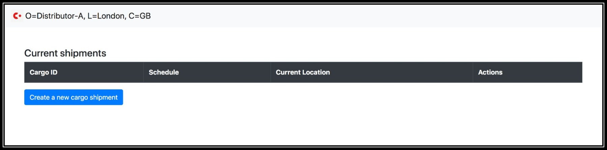
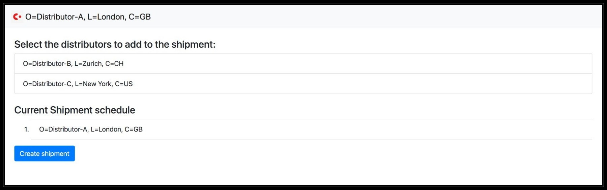
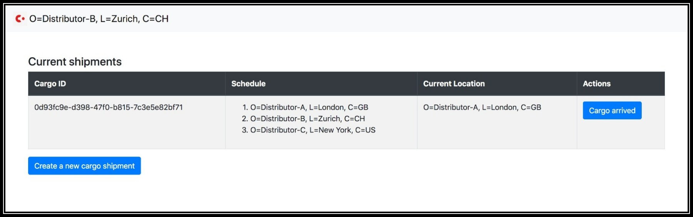
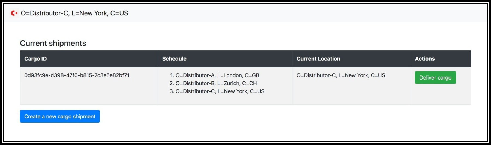

# Corda - Supply Chain demo CorDapp

This is a demo CorDapp, demonstrating a simplified supply chain workflow.
It's been created based on the CorDapp template provided [here](https://github.com/corda/cordapp-template-kotlin). 

The main parties of the workflow are the various **distributors** of a **cargo** item. 
Every item is can be scheduled to be transported from a distributor A to distributor Z via a pre-arranged list of co-operating distributors.
The main *flows* are the following:
* `EnterFlow`: supposed to be triggered by the distributor that will be the first in the chain, notifying all the involved distributors about the expected trip schedule of the item.
* `ArrivalFlow`: triggered when the cargo arrives at a distributor, notifying all the involved distributors that the cargo has arrived at the next station.
* `ExitFlow`: supposed to be triggered by the distributor that is the last in the chain, essentially notifying the other distributors that the cargo has been delivered to its final destination.

The cargo items are represented via a `LinearState` in the ledger.

For a more detailed, high-level description, you can read the following [blogpost](https://dimosr.github.io/dissecting-a-cordapp/).

## How to run the demo from terminal

* Deploy nodes
```
./gradlew deployNodes
```
* Start the nodes
```
./build/nodes/runnodes
```
* Create a trip for a cargo item, triggering an `EnterFlow` from distributor A.
```
flow start EnterCargoFlow tripDistributors: ["O=Distributor-A,L=London,C=GB", "O=Distributor-B,L=Zurich,C=CH", "O=Distributor-C,L=New York,C=US"], notary: "O=Notary,L=London,C=GB"
```
* Keep track of the ID returned from the previous command, which represents the cargo ID (say `1adcea7d-a81a-405e-80ac-ad08f860a75a`)
* Simulate arrival of the cargo in the next 2 stations (distributors B, C) by executing the following in their terminals:
```
flow start CargoArrivalReceiverFlow cargoID: 1adcea7d-a81a-405e-80ac-ad08f860a75a
```
* Simulate delivery of the cargo, by executing the following in the final distributor (C):
```
flow start ExitCargoFlow cargoID: 1adcea7d-a81a-405e-80ac-ad08f860a75a
```

## How to run the demo from the web interface

* Deploy and start the nodes as shown above

* Start one web server for each distributor, using the following commands:
```
./gradlew runWebServer --args='--server.port=10050 --config.rpc.host=localhost --config.rpc.port=10006 --config.rpc.username=user --config.rpc.password=test'
./gradlew runWebServer --args='--server.port=10051 --config.rpc.host=localhost --config.rpc.port=10009 --config.rpc.username=user --config.rpc.password=test'
./gradlew runWebServer --args='--server.port=10052 --config.rpc.host=localhost --config.rpc.port=10012 --config.rpc.username=user --config.rpc.password=test'
```
There should be now 3 web servers running:
* one listening in port 10050, connected to Distributor-A
* one listening in port 10051, connected to Distributor-B
* one listening in port 10052, connected to Distributor-C

* You can visit the home page of Distributor-A, which will contain an empty table, since no shipments have been created.



* By clicking on the button to create a new shipment, you will be moved to a separate page that allows you to specify the distributors included in the shipment.



* After creating the shipment, you will be navigate back to the home page that now contains the newly created shipment. If you visit the second distributor of the shipment, you will see it contains an action button, which notifies that the cargo has been delivered at this distributor.



* When the cargo has arrived to the final distributor, there will be a separate button that delivers the cargo, which essentially exits the associated state from the ledger.



## Disclaimer

This project is developed for demonstration purposes and is **not suitable for production use**.

## Things to add

Below are some of the things I wanted to add, but did not have time to, so any contributions will be welcome:
* Integration of the Rx observables (containing vault updates) with web sockets, so that the web browser automatically receives update and there is no need to refresh the page.
* Integration with a front-end API, so that the various stations and the current location of a shipment can be visualised in a map.
* Add the option to include an attachment on every transition between stations, so that distributors can attach a `.pdf` file, containing additional information for a shipment.
* Add integration with Corda's [Node Explorer](https://docs.corda.net/node-explorer.html) that provides out-of-the-box map integration and also allows CorDapps to provide custom widgets for dashboards.
